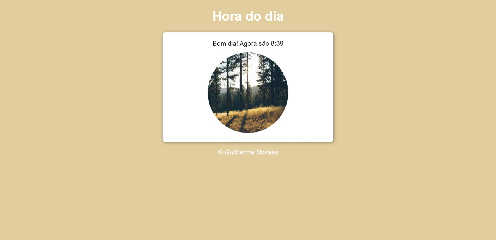
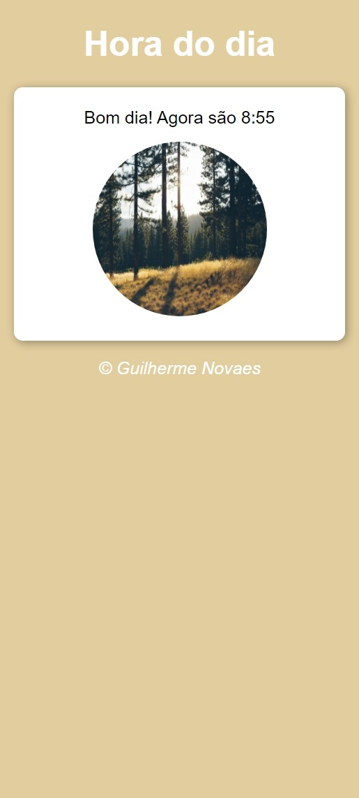

# Curso em Vídeo - Curso de JavaScript - Exercício Hora do dia

Esta é uma solução para o [Exercício 14 proposto para resolução](https://www.cursoemvideo.com/curso/javascript/).

## Índice

- [Visão geral](#visão-geral)
  - [Screenshot](#screenshot)
  - [Links](#links)
- [Meu processo](#meu-processo)
  - [Feito com](#feito-com)
  - [O que aprendi](#o-que-aprendi)
  - [Desenvolvimento contínuo](#Desenvolvimento-contínuo)
- [Autor](#autor)

## Visão geral

### Screenshot

### Links

- Visualização do site: [Visualizar](https://guilherme-rnovaes.github.io/hora-do-dia/)

## Meu processo

### Feito com

- HTML5 semântico
- CSS3
- JavaScript

### O que aprendi

Aprendi mais sobre o HTML semântico e aprofundei muito mais meus conhecimentos com CSS e responsividade, me desafiando a tornar o exercício responsivo para demais plataformas, como também apromorando e aplicando meus novos conhecimentos em JavaScript de forma a fixar o conteúdo aprendido no curso, como as "condicionais".

###  Desenvolvimento contínuo

Pretendo continuar estudando sobre HTML semântico, CSS com flexBox e aprimorando os meus conhecimentos com responsividade, como também aprender e praticar muito mais JavaScript. Estou muito satisfeito com o resultado, o que está me impulsionando ainda mais a continuar estudando e aprendendo.

## Autor

- GitHub - [Guilherme Rogério Novaes](https://github.com/Guilherme-RNovaes)
- LinkedIn - [@Guilherme-RNovaes](https://www.linkedin.com/in/guilherme-r-novaes/)
